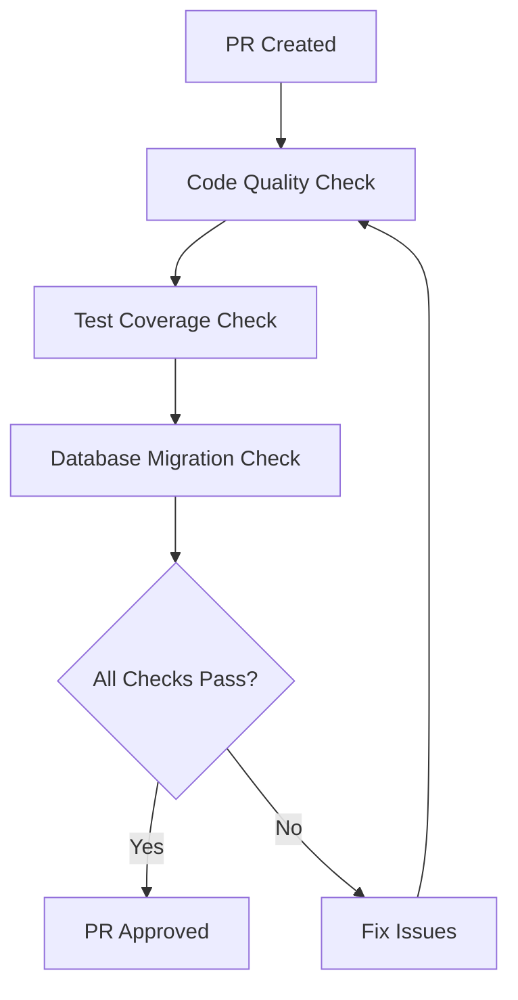
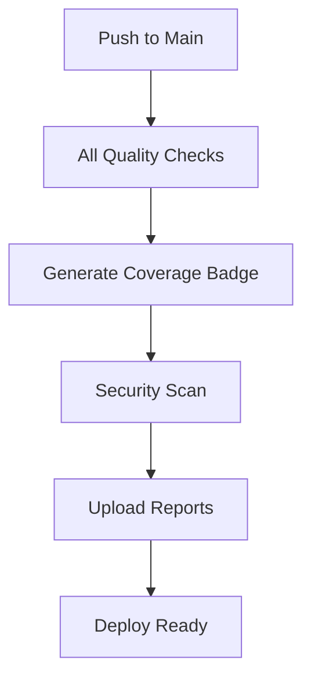

# CI/CD Workflows Documentation

## Overview

This project implements comprehensive CI/CD pipelines using GitHub Actions to ensure code quality, security, and reliability. The workflows are designed to catch issues early and maintain high standards throughout the development lifecycle.

## 🚀 Workflow Architecture

```
GitHub Actions Workflows
├── code-quality.yml           # Code formatting, linting & static analysis
├── test-coverage.yml          # Test execution & coverage validation
└── database-migration.yml     # Database schema validation
```

## 📋 Workflow Details

### 1. Code Quality & Formatting (`code-quality.yml`)

**Triggers:**
- Push to `main` or `develop` branches
- Pull requests to `main` or `develop` branches

**Jobs:**

#### 🎨 Code Formatting & Linting
- **ktlint**: Kotlin code formatting validation
- **Auto-formatting**: Automatically formats code in PRs
- **Detekt**: Static code analysis for Kotlin
- **Build validation**: Ensures code compiles correctly
- **Dependency security**: Scans for vulnerable dependencies

#### 📚 Documentation Check
- Validates required documentation exists
- Checks Markdown formatting with markdownlint
- Ensures no TODO comments in production code

#### 🔒 Security Analysis
- **Trivy**: Vulnerability scanning for main branch
- **SARIF reporting**: Security findings uploaded to GitHub Security tab

**Coverage:**
```
✅ Code formatting (Google Java Format style)
✅ Static analysis (Detekt rules)
✅ Build validation
✅ Documentation completeness
✅ Security vulnerability scanning
✅ Dependency vulnerability checking
```

**Quality Gates:**
- Code must pass ktlint formatting checks
- Detekt static analysis must pass
- All builds must succeed
- Required documentation must exist
- No high-severity security vulnerabilities

### 2. Test Coverage Validation (`test-coverage.yml`)

**Triggers:**
- Push to `main` or `develop` branches
- Pull requests to `main` or `develop` branches
- Manual trigger via `workflow_dispatch`

**Services:**
- **PostgreSQL 17**: Full database for integration testing

**Coverage Thresholds:**
- **Line Coverage**: ≥ 90%
- **Branch Coverage**: ≥ 80%
- **Instruction Coverage**: ≥ 90%

**Features:**
```
✅ Comprehensive test execution
✅ JaCoCo coverage reporting
✅ Multi-format reports (XML, HTML)
✅ Codecov integration
✅ Codacy integration
✅ PR coverage comments
✅ Coverage badge generation
✅ Quality gate enforcement
```

**Reports Generated:**
- JaCoCo XML report (for CI/CD tools)
- JaCoCo HTML report (for developers)
- GitHub Step Summary with metrics
- PR comments with coverage details
- Coverage badges for README

### 3. Database Migration Testing (`database-migration.yml`)

**Triggers:**
- Push to `main` or `develop` with database changes
- Pull requests affecting database files
- Manual trigger via `workflow_dispatch`

**Jobs:**

#### 🗃️ Liquibase Validation
- **Syntax validation**: Ensures changelog syntax is correct
- **Migration execution**: Applies all changes to clean database
- **Schema verification**: Validates database structure
- **Rollback testing**: Tests rollback capabilities (dry-run)
- **Tracking verification**: Ensures Liquibase tracking works

#### 🔄 Multi-Database Testing
- **PostgreSQL 15, 16, 17**: Compatibility testing across versions
- **Matrix strategy**: Parallel execution for efficiency
- **Version-specific validation**: Ensures migrations work across versions

#### ⚡ Performance Testing
- **Migration timing**: Measures execution time
- **Performance thresholds**: Fails if migrations are too slow
- **Database size analysis**: Reports on schema size
- **Optimization recommendations**: Suggests improvements

#### 🔒 Security Analysis
- **Sensitive data detection**: Scans for hardcoded credentials
- **SQL injection patterns**: Identifies dangerous operations
- **PII detection**: Warns about personal information in migrations
- **Changelog structure validation**: Ensures proper YAML structure

**Coverage:**
```
✅ Migration syntax validation
✅ Multi-version PostgreSQL compatibility
✅ Performance monitoring
✅ Security vulnerability scanning  
✅ Rollback capability testing
✅ Schema structure verification
✅ Tracking table validation
```

## 🛠️ Tool Configuration

### Code Quality Tools

#### Ktlint (Kotlin Formatting)
```kotlin
// Configuration in build.gradle.kts
ktlint {
    version.set("1.0.1")
    outputToConsole.set(true)
    ignoreFailures.set(false)
    
    filter {
        exclude("**/generated/**")
        include("**/kotlin/**")
    }
}
```

#### Detekt (Static Analysis)
- **Configuration**: `config/detekt/detekt.yml`
- **Rules**: 200+ code quality rules enabled
- **Reports**: HTML, XML, TXT, SARIF, Markdown
- **Complexity limits**: Method complexity ≤ 15, class size ≤ 600 lines

#### JaCoCo (Test Coverage)
```kotlin
// Coverage thresholds enforced
violationRules {
    rule {
        limit {
            counter = "LINE"
            minimum = "0.80".toBigDecimal()
        }
    }
}
```

#### OWASP Dependency Check
- **CVSS threshold**: 7.0 (fail build on high severity)
- **Suppressions**: `config/dependency-check/suppressions.xml`
- **Multiple analyzers**: Maven, Gradle, OSS Index

### Database Tools

#### Liquibase
- **Version**: 4.32
- **PostgreSQL JDBC**: 42.7.4
- **Changelog structure**: YAML-based with includes
- **Validation**: Syntax, execution, rollback testing

## 🔄 Workflow Orchestration

### Pull Request Flow


### Main Branch Flow


## 📊 Quality Metrics Dashboard

### Real-time Monitoring
- **GitHub Actions**: Workflow status and history
- **Codecov**: Coverage trends and reports  
- **GitHub Security**: Vulnerability alerts
- **PR Comments**: Instant feedback on changes

### Key Performance Indicators
- **Build Success Rate**: Target > 95%
- **Test Coverage**: Line coverage ≥ 90%
- **Code Quality**: 0 Detekt violations
- **Security**: 0 high-severity vulnerabilities
- **Migration Performance**: < 60 seconds

## 🚨 Failure Handling

### Automatic Actions
- **Code formatting**: Auto-fix in PRs
- **Dependency updates**: Automated PRs for security patches
- **Coverage reports**: Uploaded even on test failures
- **Retry logic**: Transient failures are retried

### Manual Interventions Required
- **Coverage below threshold**: Add more tests
- **Detekt violations**: Fix code quality issues
- **Migration failures**: Fix database schema issues
- **Security vulnerabilities**: Update dependencies or suppress with justification

## 🏃‍♂️ Running Workflows Locally

### Prerequisites
```bash
# Install required tools
sudo apt-get install postgresql-client

# Java 21 (via SDKMAN)
sdk install java 21.0.1-tem

# Docker (for database)
sudo apt-get install docker.io docker-compose
```

### Local Execution
```bash
# Code quality checks
./gradlew ktlintCheck detekt

# Test with coverage
./gradlew test jacocoTestReport

# Database migration test
docker-compose up -d db
./gradlew liquibaseUpdate

# Full quality check
./gradlew check
```

### IDE Integration
- **IntelliJ IDEA**: ktlint, Detekt plugins
- **VS Code**: Kotlin, Detekt extensions
- **Coverage**: JaCoCo plugin for IDE coverage display

## 📈 Continuous Improvement

### Metrics Collection
- **Workflow execution times**
- **Test execution performance**
- **Coverage trends over time**
- **Security vulnerability trends**

### Regular Reviews
- **Monthly**: Review quality gate thresholds
- **Quarterly**: Update tool versions
- **Per release**: Analyze failure patterns
- **Annually**: Evaluate new tools and practices

## 🔧 Configuration Management

### Sensitive Data
- **Secrets**: Stored in GitHub repository secrets
- **Environment variables**: Defined per environment
- **Database credentials**: Auto-generated for testing

### Version Management
- **Tool versions**: Pinned in build files
- **Action versions**: Using specific tags (v4, not latest)
- **Dependencies**: Locked with version catalogs

## 💡 Best Practices Implemented

### Security
✅ No secrets in code or logs  
✅ Minimal permissions for workflows  
✅ Dependency vulnerability scanning  
✅ Static analysis for security issues  
✅ SARIF reporting for security findings  

### Performance
✅ Parallel job execution  
✅ Gradle build cache  
✅ Docker layer caching  
✅ Conditional execution based on file changes  
✅ Workflow artifact reuse  

### Reliability
✅ Matrix testing across environments  
✅ Retry mechanisms for flaky tests  
✅ Comprehensive error reporting  
✅ Detailed logging and debugging info  
✅ Fallback strategies for external dependencies  

### Developer Experience
✅ Clear failure messages  
✅ Automatic code formatting  
✅ Rich PR comments with actionable feedback  
✅ Visual coverage reports  
✅ Quick local reproduction steps  

This comprehensive CI/CD setup ensures that every change to the codebase maintains high quality, security, and reliability standards while providing excellent developer experience and fast feedback cycles.